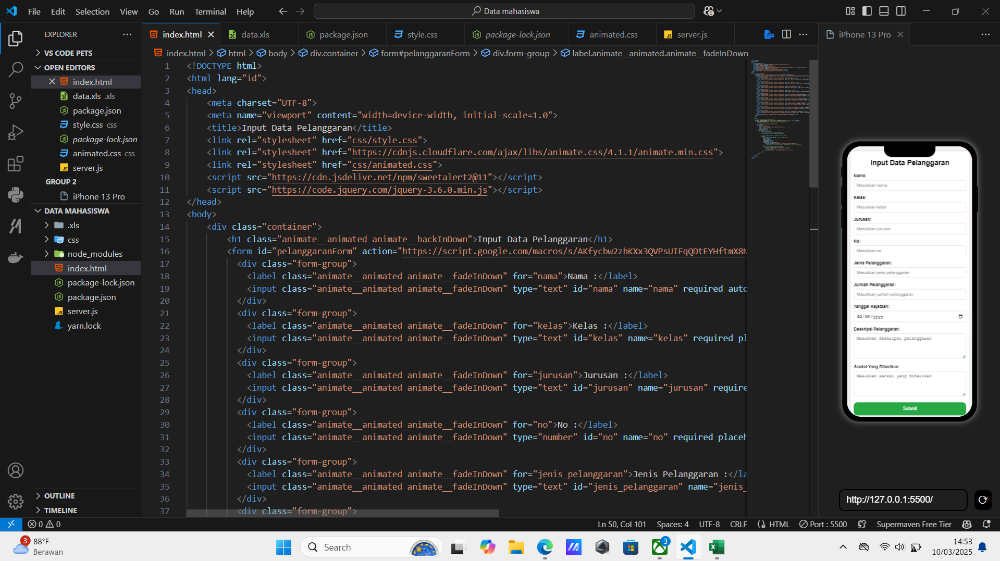
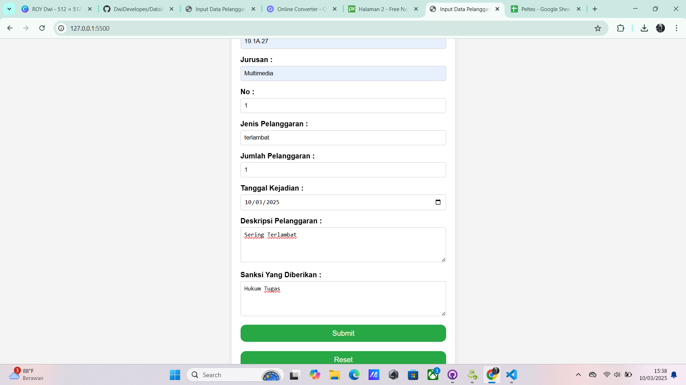
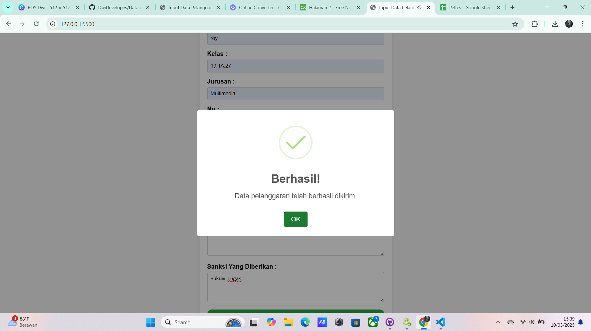
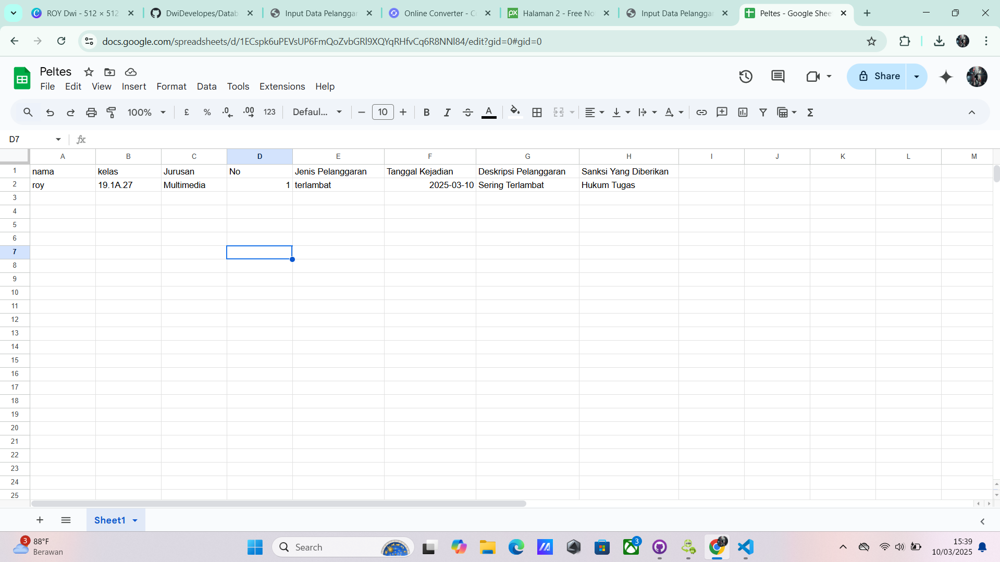

# Data Mahasiswa

Aplikasi ini digunakan untuk mengambil data mahasiswa dari Google Sheets. Aplikasi ini dibuat menggunakan JavaScript dan menggunakan fitur AJAX untuk memasukkan data ke Google Sheets.

## Fitur

- Menambahkan data mahasiswa ke Google Sheets
- Menambahkan data mahasiswa ke Google Sheets dengan menggunakan fitur AJAX

## Penggunaan

1. Buka Google Sheets dengan data mahasiswa yang diinginkan.
2. Klik tombol "Share" di bagian atas layar.
3. Klik "Publish to the web" dan pilih "Start publishing".
4. Pilih "Get the link" dan salin URL yang dihasilkan.
5. Buka Aplikasi Data Mahasiswa di GitHub.
6. Klik tombol "Fork" di bagian atas layar.
7. Salin URL yang dihasilkan di bagian atas layar.
8. Buka file "server.js" di folder "c:/Users/User/Documents/Apk Sederhana Content/Data mahasiswa".
9. Ubah URL yang dihasilkan di bagian atas layar dengan URL yang telah Anda salin di langkah sebelumnya.
10. Klik tombol "Save" dan "Commit changes".
11. Klik tombol "Create a new branch" dan pilih "main".
12. Klik tombol "Create pull request".
13. Klik tombol "Merge pull request".
14. Buka Google Sheets dan cek data mahasiswa yang telah ditambahkan.

## Screenshot

## Kontribusi

Jika Anda ingin berkontribusi, Anda dapat mengirimkan pull request ke repositori ini.        

## Lisensi   

Aplikasi ini dibuat dengan lisensi [MIT](https://github.com/DwiDevelopes)

## Author

[Dwi Bakti N Dev](https://github.com/DwiDevelopes)

## Dev

[Dwi Bakti N Dev](https://github.com/DwiDevelopes)

## Thanks

- [Google Apps Script](https://developers.google.com/apps-script/)
- [jQuery](https://jquery.com/)
- [SweetAlert2](https://sweetalert2.github.io/)

## Reference

- [Google Apps Script](https://developers.google.com/apps-script/)
- [jQuery](https://jquery.com/) 
- [SweetAlert2](https://sweetalert2.github.io/)

## Note

- Aplikasi ini dibuat dengan menggunakan fitur AJAX untuk memasukkan data ke Google Sheets. Jika Anda tidak mengetahui cara menggunakan fitur AJAX, Anda dapat mengikuti tutorial di [Google Developers](https://developers.google.com/apps-script/guides/html/communication).
- Aplikasi ini dibuat dengan menggunakan JavaScript dan menggunakan fitur AJAX untuk memasukkan data ke Google Sheets. Jika Anda tidak mengetahui cara menggunakan JavaScript, Anda dapat mengikuti tutorial di [Google Developers](https://developers.google.com/apps-script/guides/html/communication).

## Disclaimer

Aplikasi ini dibuat dengan menggunakan JavaScript dan menggunakan fitur AJAX untuk memasukkan data ke Google Sheets. Jika Anda tidak mengetahui cara menggunakan JavaScript, Anda dapat mengikuti tutorial di [Google Developers](https://developers.google.com/apps-script/guides/html/communication).

## Contact

Jika Anda memiliki pertanyaan atau ingin berkontribusi, Anda dapat menghubungi saya melalui email di [dwbaktin@gmail.com](mailto:dwbakti76@gmail.com).

## apps
    
    